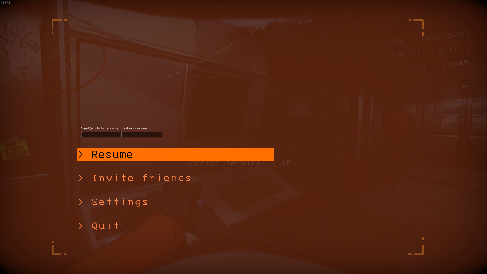

# LCSeedPicker
A Lethal Company mod that allows players to set the seed of the moon.

## Setting the seed
A seed can be set by opening the Quick menu (ESC menu)

The seed is then used for generating the moon

